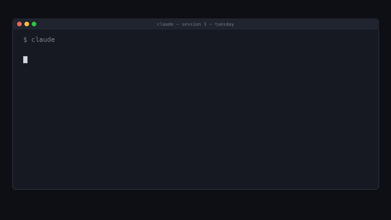

# Unified Agent Context

[English](README.md) | **한국어** | [中文](README.zh-CN.md) | [日本語](README.ja.md) | [Español](README.es.md)

모든 새 AI 채팅은 기억상실에서 시작한다. 어제 Claude에게 README는 영어가 기본이라고
말했는데, 오늘 아침엔 Codex가 묻는다. 오늘 밤엔 세 번째 에이전트가 또 물을 것이다.
다섯 개의 AI 에이전트를 쓰지만, 그들이 공유하는 유일한 기억은 당신뿐이다 —
당신은 자신을 재설명 한 번에 하나씩 소모하고 있다.

**Unified Agent Context가 그것을 끝낸다.** 어떤 에이전트에게든 결정을 한 번만
말하라 — claude code, codex, hermes, gajaecode, lettacode — 다른 모든 에이전트가
바로 다음 세션에서 그것을 알고 있다. 자동으로, 모든 기기에서, 비밀 정보는
설계 단계부터 차단된 채로.



## 아키텍처 (정본 = sov, 기기 독립 접근)

```
에이전트들 ──(MCP stdio, 원격이면 ssh 경유)──► mcp-memory-keeper (정본: sov ~/.uac/data/memory)
   │  ▲
   │  └─ 세션 시작: 증류된 사실만 주입 (훅 또는 지시 pull) — scripts/inject-context.mjs
   └──── 세션 중 명시 기록 (record-fact) / 종료 자동 증류 (distill-session)
              └─ 모든 저장 경로는 중앙 fail-closed 비밀 게이트 경유 (차단 or redact)
              └─ 영구 팩트는 사서 outbox 큐잉 → librarian-sync가 sov Letta "The Noticer" inbox로 배달 (Phase 5)
```

- 스코프: `global`(선호) vs `project:<git-root-basename>`(결정/작업 상태) — 프로젝트 간 누출 차단 (서버 쿼리 강제)
- TTL: decision/preference 영구 보존, project_state 90일
- 원본 대화는 콜드 아카이브만 (주입 금지, 비밀은 redact-only)
- degraded mode: 서버 부재 시 warning/log/health/metric 4증거 방출, `UAC_STRICT=1`이면 실패 처리
- 기기 독립: 정본 스토어는 sov — Mac 등 다른 기기는 `uac.config.json`의 ssh 스폰으로 접근 (Phase 6)
- v2 예정: 오프라인 로컬 큐 + 재동기화 / 셀프호스팅 원격 MCP + 인증 → claude.ai 합류

## 문서

| 문서 | 내용 |
|------|------|
| `docs/phase0-comparison.md` | 저장소 후보 대조표 + 채택 근거 |
| `docs/phase1-storage.md` | 스키마/스코프/TTL/비밀 게이트 |
| `docs/phase2-hooks.md` | 하네스 5종 배선 + degraded mode |
| `docs/phase3-write-paths.md` | 기록 경로 5종 + 증류/검역 |
| `docs/phase4-coverage-matrix.md` | 20경로 커버리지 매트릭스 + 검증 계층 |
| `docs/phase5-librarian.md` | Letta 사서 handoff lane (single-writer 큐레이션) |
| `docs/phase6-remote.md` | 정본 스토어 sov 이전 + ssh stdio-MCP 접근 |
| `docs/onboarding.md` | **신규 에이전트 합류 절차 (5분)** |
| `docs/handoff-tailscale-connectivity.md` | 스토어 연결(Tailscale/LAN) 이슈 + 자동 폴백 핸드오프 프롬프트 |

## 주요 커맨드

```sh
node scripts/inject-context.mjs [--cwd <dir>]        # 공유 컨텍스트 블록 출력
node scripts/record-fact.mjs --type decision "..."   # 명시 기록 (비밀은 exit 3 차단)
node scripts/distill-session.mjs --file <transcript> # 세션 증류 + 검역 스윕
node scripts/librarian-sync.mjs [--strict]           # outbox → sov 사서 inbox 배달 (Phase 5)
node scripts/doctor.mjs                              # 배선 자가진단
node scripts/cross-verify.mjs                        # 20경로 커버리지 매트릭스 재실행
node scripts/reexplain.mjs log|report                # 재설명 계측 (2주 관문 보조지표)
node --test 'tests/*.test.mjs'                       # 전체 테스트 (73)
```

## 2주 실사용 관문 (진행 중)

시나리오 테스트는 전부 통과 상태. 최종 합격은 **2주 실사용에서 "다시 설명하는" 체감이 사라졌는지** 사용자 확인으로 판정한다. 재설명이 발생할 때마다 `reexplain.mjs log`로 기록하고, 2주 후 `report`의 주간 추이가 0에 수렴하는지 본다.

## 크레딧

**[GJC (Gajae Code)](https://github.com/Yeachan-Heo/gajae-code)** — AI 코딩
에이전트 — 와 함께 처음부터 끝까지 만들었다: 스토어 페이즈들, 5개 언어
README의 내러티브 스타일, 그리고 위의 프로모 애니메이션까지 GJC가 구현하고
검증하고 배포했다 — 만드는 동안 UAC 자신의 공유 메모리를 사용하면서.
